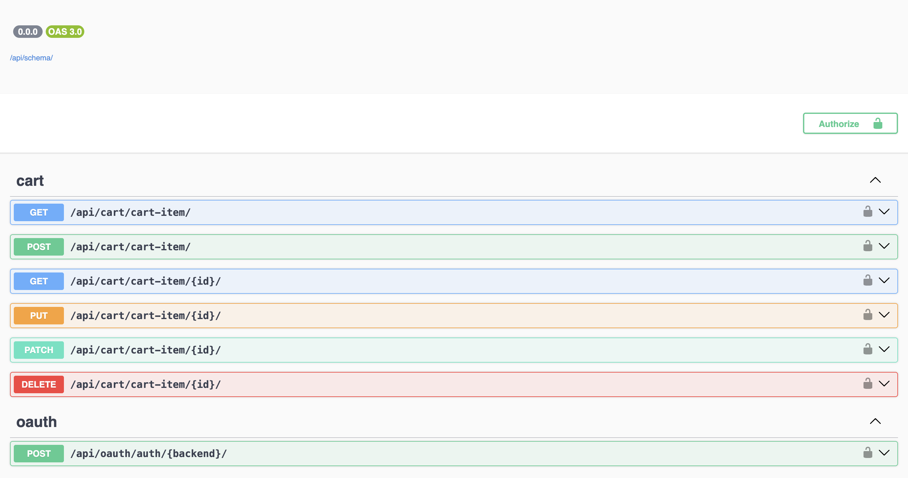
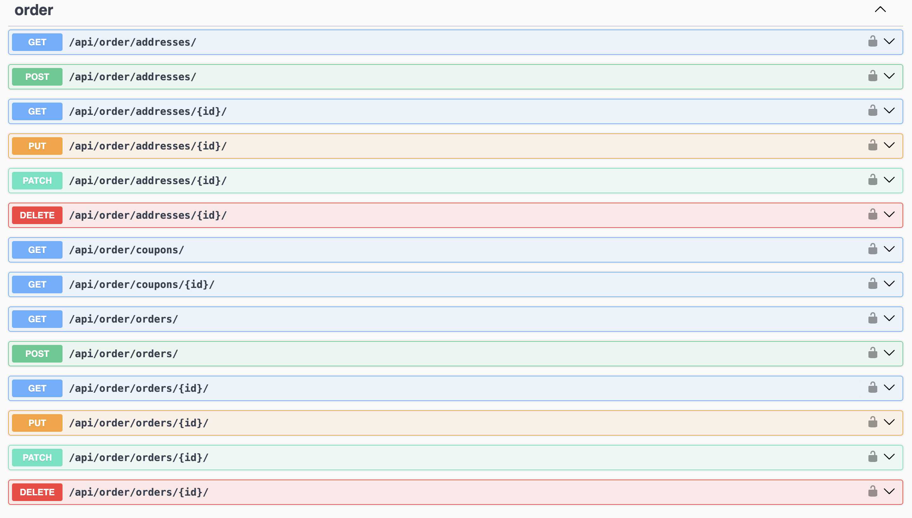
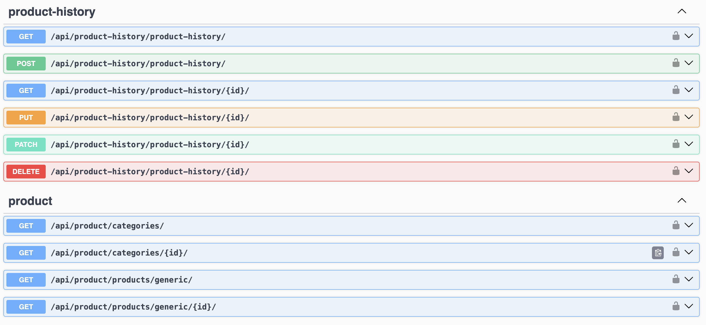
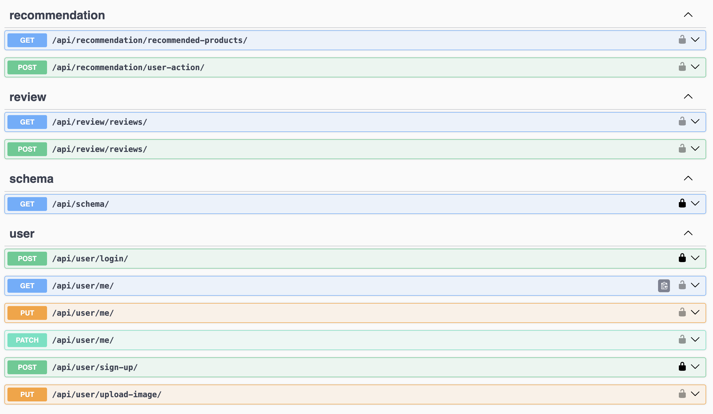
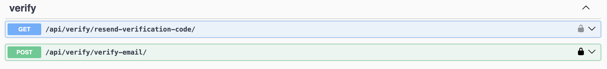
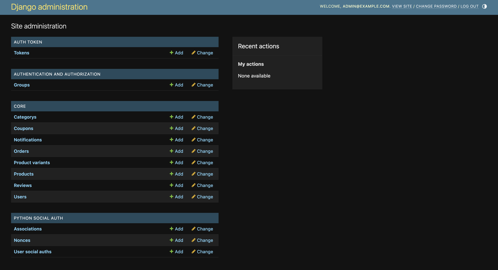
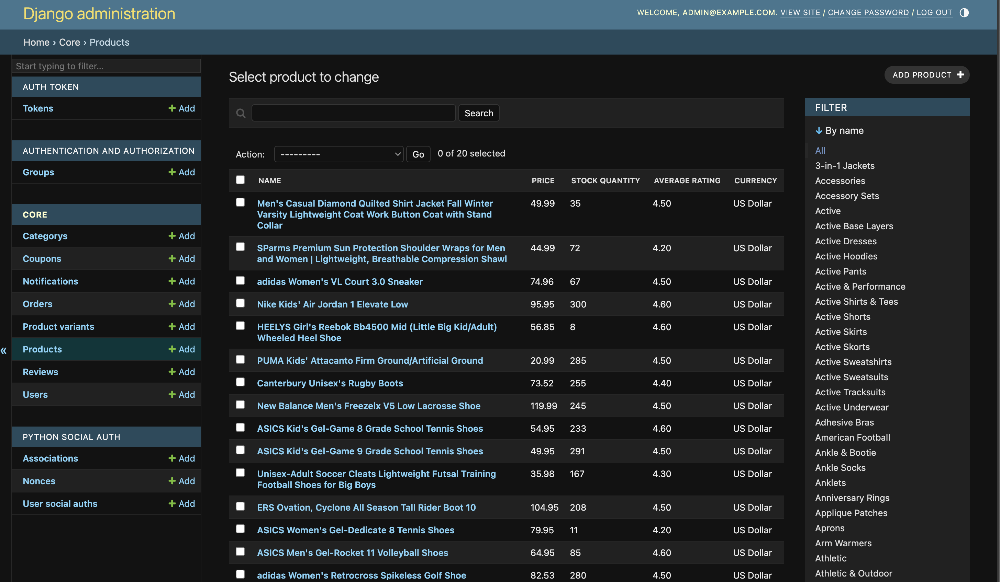
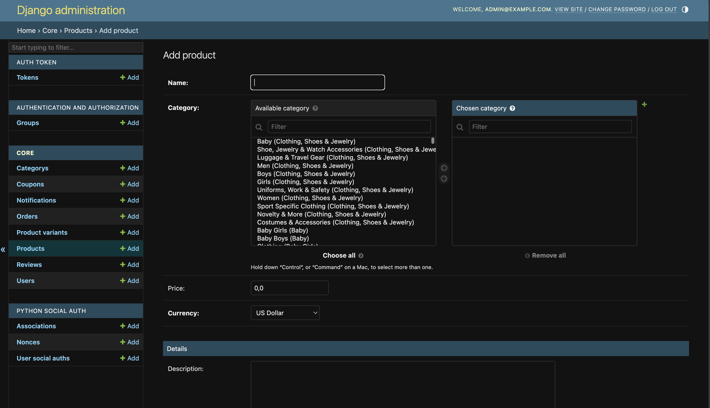
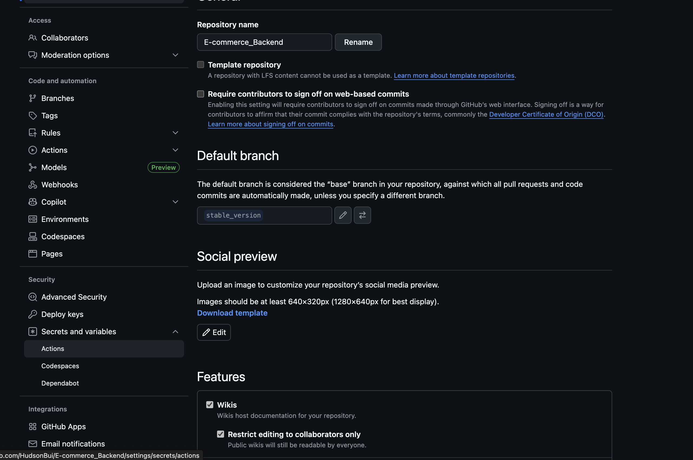

Collecting workspace information# E-commerce Backend

A robust and scalable e-commerce REST API backend built with Django and Django REST Framework. This project provides comprehensive endpoints for managing users, products, categories, cart functionality, orders, and authentication.

## Appearance
- **API**

  
  
  
  
  
...

- **Admin site**

  
  
   
...

## Features

- **User Management**
  - Registration with email verification
  - Authentication with token-based system
  - Social authentication (Google, Facebook)
  - Profile management with image upload

- **Product System**
  - Categorization with hierarchical structure
  - Product variants (color, size)
  - Detailed product information
  - Image management
  - Pricing and stock control

- **Order & Cart Processing**
  - Shopping cart management
  - Order placement and detailed history
  - Order status tracking

- **Recommendation Engine**
  - Deep-learning model (Neural Collaborative Filtering) recommendations products for users.

- **API Documentation**
  - Automatic OpenAPI schema generation
  - Interactive API documentation

## Tech Stack

- **Framework**: Django, Django REST Framework
- **Database**: PostgreSQL
- **Authentication**: DRF Token Authentication, Social Auth (OAuth2)
- **AI/ML**: TensorFlow, Scikit-learn, Pandas
- **Documentation**: drf-spectacular (OpenAPI 3)
- **Containerization**: Docker, Docker Compose
- **CI/CD**: GitHub Actions for automated checks

## Project Structure

```
app/
  ├── app/                # Main Django project settings and URLs
  ├── cart/               # Shopping cart management
  ├── core/               # Core models, custom commands, and utilities
  ├── email_verification/ # Email verification system
  ├── oauth/              # Social authentication (Google, Facebook)
  ├── order/              # Order processing and history
  ├── product/            # Product catalog, categories, and variants
  ├── recommendation/     # AI-based product recommendation engine
  ├── review/             # Product reviews and ratings
  ├── user/               # User management and token authentication
  └── watched_list/       # User's watched products list
proxy/                    # Nginx proxy configuration
scripts/                  # Helper scripts for running the application
```

## Getting Started

### Prerequisites

- Docker and Docker Compose
- Git LSF

### Environment Setup

1. Clone the repository:
   ```bash
   git clone https://github.com/yourusername/E-commerce_Backend.git
   cd E-commerce_Backend
   ```

2. Create a .env file in the project root with the following variables:
   ```
   POSTGRES_DB=ecommerce
   POSTGRES_USER=your_user
   POSTGRES_PASSWORD=your_password
   SECRET_DOCKER_SETTINGS_KEY=your_secret_key
   DJANGO_ALLOWED_HOSTS=10.0.2.2,127.0.0.1
   EMAIL_HOST_USER=<Your email>
   EMAIL_HOST_PASSWORD=<Search: Google app password, Enter your email and paste it in ter> (it's supposed to include 16 characters)

   # Optional social auth credentials
   GOOGLE_OAUTH2_KEY=your_google_key
   GOOGLE_OAUTH2_SECRET=your_google_secret
   FACEBOOK_KEY=your_facebook_key
   FACEBOOK_SECRET=your_facebook_secret
   ```
  
3. Add these variable to git (Setting/Secrets and variables/Action)



### Prepare data

1. Run docker
  ```bash
  docker build .
  ```
  ```bash
  docker compose build
  ```

2. Migrate database
  ```bash
  docker compose run --rm app sh -c "python manage.py makemigrations"
  ```
  ```bash
  docker compose run --rm app sh -c "python manage.py migrate"
  ```

3. Import CSV data
  ```bash
  docker compose run --rm app sh -c "python manage.py import_csv_data /app/datasample/ClothingDataset.csv"
  ```

4. Create super user
  ```bash
  docker compose run --rm app sh -c "python manage.py createsuperuser"
  ```

### Running the Application

1. Start the containers:
   ```bash
   docker-compose up
   ```

2. Access the API at http://127.0.0.1:8000/api/
3. API Documentation is available at http://127.0.0.1:8000/api/docs/
4. Admin site is available at http://127.0.0.1:8000/admin/


### Products

- `GET /api/product/products/generic/`: List all products with basic information
- `GET /api/product/products/generic/{id}/`: Get detailed product information
- Supports filtering by category and name

## Development

### Running Tests

```bash
docker-compose run --rm app sh -c "python manage.py test"
```

### Code Quality

```bash
docker-compose run --rm app sh -c "flake8"
```

### Making Migrations

```bash
docker-compose run --rm app sh -c "python manage.py makemigrations"
docker-compose run --rm app sh -c "python manage.py migrate"
```

### Creating a Superuser

```bash
docker-compose run --rm app sh -c "python manage.py createsuperuser"
```

## Deployment

The application is containerized and ready for deployment to various platforms:

- For production deployment, update the settings.py file to:
  - Set `DEBUG=False`
  - Configure proper email backend settings
  - Add your domain to `DJANGO_ALLOWED_HOSTS`
  - Set up proper static and media file serving

## Come along app
You can download this repo to implement the UI for this repo
  ```bash
  git clone https://github.com/heluDuyne/E-Commerce_FrontEnd.git
  ```


## Contributing

1. Fork the repository
2. Create a feature branch (`git checkout -b feature/amazing-feature`)
3. Commit your changes (`git commit -m 'Add some amazing feature'`)
4. Push to the branch (`git push origin feature/amazing-feature`)
5. Open a Pull Request

---

*Note: This README will be updated with more information as the project evolves.*
